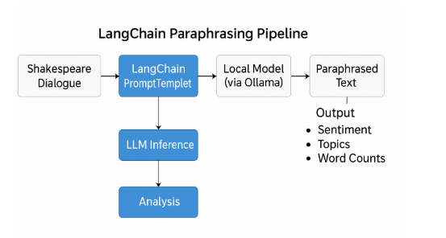

# Hamlet NLP + LLM Paraphrasing Analysis

This project explores how large language models (LLMs) interpret and rephrase Shakespeare's *Hamlet* using **LangChain**, **Ollama**, and classic **NLP techniques**.  
We paraphrase the original lines into natural modern English, then run sentiment analysis, topic modeling, and lexical comparisons between the original and AI-generated versions.

---

## Dataset

The original dataset comes from the [TidyTuesday project](https://github.com/rfordatascience/tidytuesday/tree/main/data/2024/2024-09-17), featuring line-by-line Hamlet dialogue, including:

- `act`  
- `scene`  
- `character`  
- `dialogue`  
- `line_number`  

The file `hamlet_paraphrased.csv` includes a `paraphrased` column with modern English rewrites.

---

## Pipeline Overview

**Input** → Shakespearean dialogue from `hamlet.csv`  
**LangChain PromptTemplate** → Prompt formatting  
**Ollama** → Local LLMs (`mistral`, `phi`)  
**Output** → `paraphrased` lines  
**Analysis** → Sentiment, topics, emotion arcs

## LangChain Pipeline Diagram

This flowchart shows the full paraphrasing pipeline used to convert Shakespearean dialogue into modern English using LangChain and Ollama:

---

### Notebooks

- `langchain_hamlet_paraphrasing.ipynb` – Paraphrasing with LangChain + Ollama
- `hamlet_paraphrasing_t5.ipynb` – Paraphrasing with Hugging Face T5 Transformer
---

## Technologies & Libraries

- **LangChain + Ollama** – Prompt orchestration & local inference  
- `pandas`, `numpy` – Data manipulation  
- `matplotlib`, `seaborn` – Visualization  
- `nltk`, `textblob` – Sentiment + tokenization  
- `wordcloud` – Frequency visualization  
- `gensim`, `bertopic` – Topic modeling (LDA + transformer-based)  
- `transformers` – T5, BART for baseline comparison  
- Hugging Face `transformers` – Used T5 for comparison to LangChain/Ollama approach

---

## NLP + LLM Analysis

- Paraphrasing: Original → Modern English  
- Sentiment comparison: Original vs paraphrased  
- Topic modeling: LDA and BERTopic  
- Character-wise emotion profiling  
- Lexical analysis (vocab size, sentence complexity)  
- Line-by-line visual comparison

---

## Key Insights

- **Tone Shift**: Emotions were softened in paraphrasing  
- **Thematic Change**: Central motifs remained, but nuance sometimes lost  
- **Character Shift**: Supporting roles became simpler in tone  
- **LLM Performance**: Fast and private inference with Ollama models

---

## Files in This Repo

Files in This Repo

| File Name                             | Description                                             |
|--------------------------------------|---------------------------------------------------------|
| `hamlet.csv`                         | Original dataset                                        |
| `hamlet_paraphrased.csv`            | Paraphrased modern English output                       |
| `topics_labeled.csv`                | Topic IDs with human-readable labels                   |
| `langchain_hamlet_paraphrasing.ipynb` | Notebook that runs LangChain + Ollama pipeline         |
| `shakespeare_paraphrasing_with_langchain.ipynb` | Full pipeline with paraphrasing and NLP analysis        |
| `hamlet_paraphrasing_t5.ipynb`    | Paraphrasing with Hugging Face T5 Transformer     |
| `README.md`                         | This file                                               |

---

---

## Let’s Connect

I'm exploring the intersection of **AI, interpretability, and literature**.  
If you're working on NLP, LangChain, or AI-assisted content — let's talk!

---
